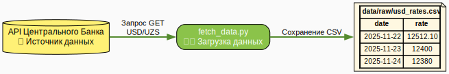
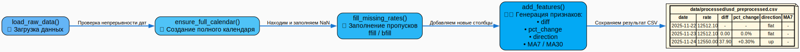
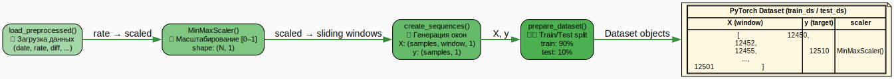
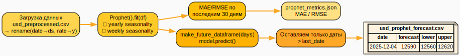
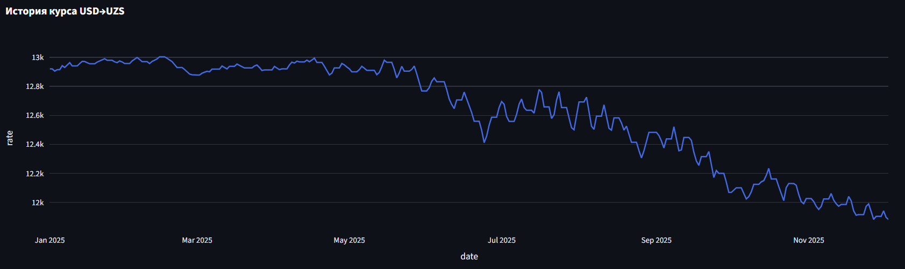
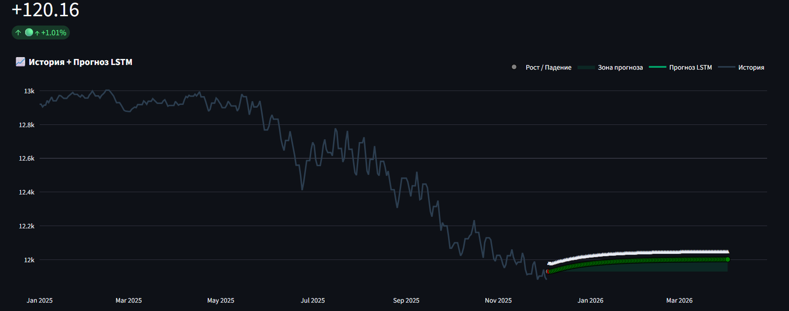
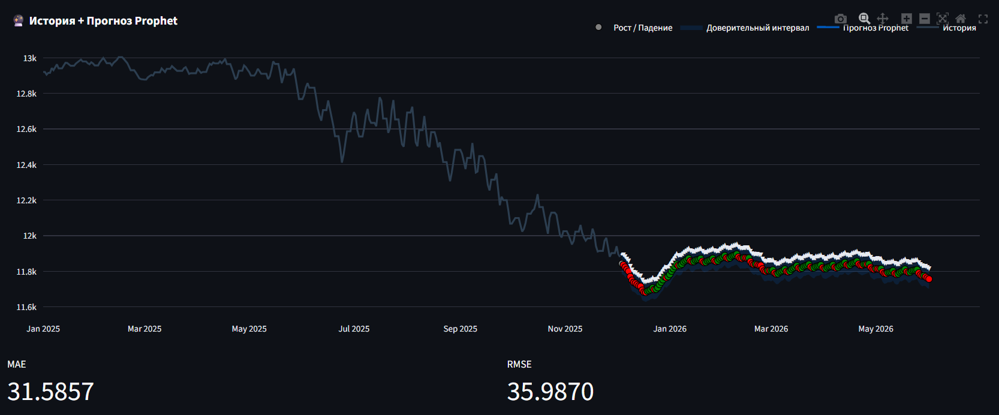
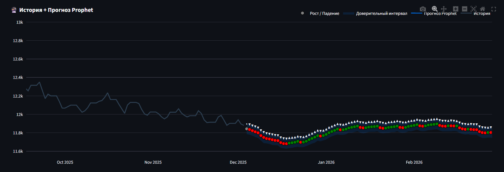
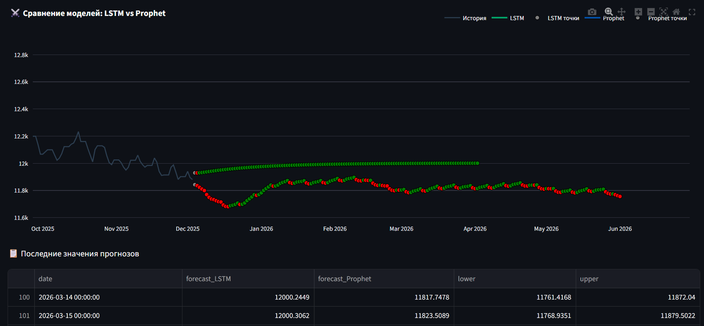

# 💵 Forecasting System
## 📈 Predictive Analytics using LSTM, Prophet & Streamlit

Этот проект — полноценная система для анализа и прогнозирования курса USD → UZS на базе:

- **LSTM (PyTorch)** — глубокое обучение
- **Prophet (Meta)** — статистическое прогнозирование
- **Streamlit** — интерактивный веб-интерфейс

Проект полностью автономен: включает подготовку данных, обучение, прогноз, визуализацию и сравнение моделей.

---

## 🚀 Возможности

### 🤖 Прогнозирование
- LSTM модель с обучением по историческим данным
- Prophet модель для быстрых статистических прогнозов
- Сравнение LSTM vs Prophet

### 📊 Визуализация
- История курса
- KPI валютного ряда
- Прогнозы с зонами роста/падения
- Доверительные интервалы Prophet
- Точки изменения тренда

### 🧱 ML Pipeline
- Предобработка данных
- Заполнение пропусков
- Инженерия признаков
- Масштабирование
- Тренировка и сохранение модели
- Проверка качества и графики

---
## System Architecture
.svg)

## Подробные архитектурные диаграммы

#### 1. Data Pipeline - Fetching Data



#### 2. Data Pipeline - Preprocessing


#### 3. Dataset Pipeline - Windows / Scaler / Split


#### 4. Training Pipeline - LSTM Training Loop


#### 5. Prophet Model Pipeline


---

## 🧱 Структура проекта
```
.
├── src/
│   ├── preprocessing/
│   │   └── preprocess.py # 🧹 Очистка данных, заполнение пропусков, feature engineering.
│   │
│   ├── model/
│   │   ├── dataset.py # 🧩 Подготовка: масштабирование (Scaler), создание временных окон (Sequences).
│   │   ├── model_lstm.py # 🧠 Архитектура: класс многослойной LSTM модели.
│   │   ├── predict.py # 🔮 Прогноз: загрузка модели и выполнение итеративного (рекурсивного) прогноза.
│   │   └── train.py # 🎯 Обучение: цикл тренировки, сохранение лучшей модели и метрик.
│   │
│   └── web/
│       └── app.py # 🖥️ Streamlit: интерактивный дашборд для визуализации прогнозов.
│
├── data/
│   ├── raw/
│   │   └── usd_rates.csv # 📄 Сырые данные, загруженные из API ЦБ (с пропусками).
│   │
│   └── processed/
│       ├── usd_preprocessed.csv # ✅ Готовые данные: очищенные и обогащенные признаками.
│       ├── usd_forecast.csv # 📈 Результат прогноза LSTM.
│       ├── usd_prophet_forecast.csv # 📊 Результат прогноза Prophet.
│       └── lstm_test_predictions.csv # 📉 Сравнение Real vs Pred на тестовом наборе.
│
├── models/
│   ├── lstm_usd_model.pth # 💾 Веса обученной LSTM модели.
│   ├── scaler.pkl # 📐 Сохраненный MinMaxScaler.
│   ├── model_config.json # ⚙️ Параметры модели (window_size, hidden_size и т.д.).
│   ├── loss_curve.png # 🖼️ График истории обучения (Loss Curve).
│   ├── loss_curve.csv
│   └── metrics.json # ⭐ Финальные метрики (MAE, RMSE) на тесте.
│
├── pyproject.toml # 📦 Конфигурация проекта и зависимости.
└── README.md # 📖 Главный файл проекта.
```
---

## 🔧 Установка

### 1. Клонируйте проект
```bash
git clone git@github.com:dadaxonEnigma/currency_forecast.git
cd currency_forecast
```

### 2. Создание виртуального окружения
Windows:
```bash
python -m venv venv
venv\Scripts\activate
```
Linux/macOS:
```bash
python3 -m venv venv
source venv/bin/activate
```

### 3. Установите зависимости
Проект использует pyproject.toml, поэтому достаточно:
```bash
pip install .
```
Если Prophet не устанавливается (частая проблема), можно вручную:
```bash
pip install prophet
```
### 4. Загрузка данных
Вариант A - последние N дней:
```bash
python -m src.data_loader.fetch_data --last 2000
```
Вариант B - за период:
```bash
python -m src.data_loader.fetch_data --start 2018-12-01 --end 2025-12-03
```
После скачивания появится файл:
```bash
data/raw/usd_rates.csv
```

### 📥 5. Предобработка данных
Создаёт файл usd_preprocessed.csv и фичи.
```bash
python -m src.preprocessing.preprocess
```
После выполнения появится:
data/processed/usd_preprocessed.csv

#### 📊 Пример визуализации



### 🤖 6. Обучение LSTM модели
Запустите тренировку:
```bash
python -m src.model.train
```
#### 📉 Loss Curve (пример)


## 🖥 7. Запуск Streamlit UI
```bash
streamlit run src/web/app.py
```
Приложение включает вкладки:
* 📘 История

* 📈 LSTM прогноз

* 🔮 Prophet прогноз

* ⚔️ Сравнение моделей

* 📊 Пример визуализаций

### История + прогноз LSTM


### Прогноз Prophet



### Сравнение моделей


## 🤝 Автор
Dadakhon Turgunboev
Machine Learning Engineer
GitHub: [https://github.com/dadaxonEnigma](https://github.com/dadaxonEnigma)
